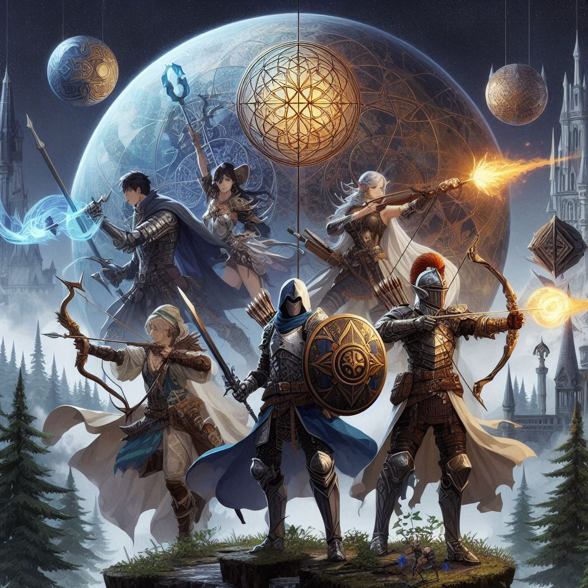

# Dojo RPG Combat System - C# Version



This is a fun kata that aim to build simple combat rules  for a role-playing game (RPG). It is implemented as a sequence of iterations.

from [source repo](https://github.com/diegodocs/coding-dojo/blob/main/challenges/rpg-combat.md)

## Requirements

- [Dotnet CLI](https://dotnet.microsoft.com/en-us/download/dotnet)
- [GIT bash](https://git-scm.com/downloads)
- [Visual Studio Code](https://code.visualstudio.com/download)

## How to Run

```powershell
dotnet restore
dotnet build
dotnet test
```

## Instructions

1. Complete each iteration before reading the next one.

## Iteration One

1. Game start with 2 player:
    - each one select a character and define a Name (max 20 chars)

1. Initially, the only Character Job available is Soldier with new info:
    - Health (HP) = 500
    - Level (LV) = 1
    - Strength (STR) = 35

1. This is turn-based game, so each player can run one action each turn    
    - The initial action available is Attack which applies Damage to a target player
    - The actor player roll a dice (random number 1-6)
    - Damage is calculated by  STR * random_number
    - The target player has the HP subtracted by Damage

1. Now, we can start with battles. You can run turns until the one player is dead
    - the actor and target change each turn (simple sequence: player 1, player 2, player 1, player 2, ...)
    - End Of Game
        - All two players start with Live Status
        - if one player achieve HP = zero, status become dead and the game ends
        - consider max of turns to avoid infinite game ( )
        - show the winner player (if both players still live, so the winner is with greater Health points)

## Iteration Two

1. Two New property was added to character:
    - Defense(DEF) = 20 (initial)
1. The Damage will be calculated
    - Actor player run a dice ( act_random 1-6)
    - Target player run a dice ( tgt_random 1-6)
    - Damage = ((act_str *act_random ) - (tgt_def* tgt_random))
1. End Of Game
    - show history based on columns:
        - actor player name
        - actor player hp
        - action
        - damage
        - Target player name
        - Target player hp (after damage)

## Iteration Three

1. New classes were added:
    - Wizard
        - Health (HP) = 400
        - Level (LV) = 1
        - Strength (STR) = 10
        - Defense(DEF) = 15
        - Magic (Mag) = 55
    - Archer
        - Health (HP) = 450
        - Level (LV) = 1
        - Strength (STR) = 45
        - Defense(DEF) = 20
        - Magic (Mag) = 40
    - Knight
        - Health (HP) = 550
        - Level (LV) = 1
        - Strength (STR) = 50
        - Defense(DEF) = 30
        - Magic (Mag) = 10
1. New Action Magic - Fire Ball
    - The Damage will be calculated
        - Actor player run a dice ( act_random 1-8)
        - Target player run a dice ( tgt_random 1-6)
        - Damage = ((act_mag *act_random ) - (tgt_mag* tgt_random))
1. New Action Magic - Heal (cure HP)
    - Heal will be calculated
        - Actor player run a dice ( act_random 1-6)
        - Heal = (act_mag * act_random )

## Iteration Four

1. Level is part of Damage Calculation
1. Experience and LevelUp
1. Critical Attack/Magic
1. Use Items
1. Battles will happen Team x Team (max 3 players each)